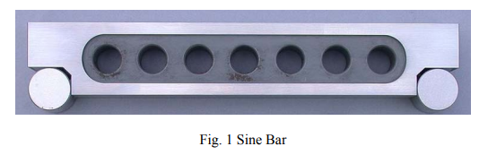

## Introduction

<b>Discipline | <b> Mechanical Engineering 
:--|:--|
<b> Lab | <b> ** Metrology and Measurement Lab**
<b> Experiment|     <b> **Measurement of Taper using Sine Bar and Experiment 3**

### About the Experiment 
**System description**

A sine bar is a tool used to measure angles in metalworking. It consists of a hardened, precision 
ground body with two precision ground cylinders fixed at the ends. The distance between the 
centers of the cylinders is precisely controlled, and the top of the bar is parallel to a line through the 
centers of the two rollers as shown in Fig. 1

            

The dimension between the two rollers is chosen to be a whole number (for ease of later 
calculations) and forms the hypotenuse of a triangle when in use.

<b>Subject matter expertise | <b> **Dr. Poonam Sundriyal**
:--|:--|
<b> Institute | <b>  **Indian Institute of Technology Kharagpur**
<b> Email id|     <b>  **psundriyal@mech.iitkgp.ac.in**
<b> Department |  **Department of Mechanical Engineering**
<b>Webpage| <b> [https://www.iitkgp.ac.in/department/ME/faculty/me-psundriyal](https://www.iitkgp.ac.in/department/ME/faculty/me-psundriyal)

<b>Subject matter expertise | <b> **Dr. Siddharth Tamang**
:--|:--|
<b> Institute | <b>  **Indian Institute of Technology Kharagpur**
<b> Email id|     <b>  **stamang@mech.iitkgp.ac.in**
<b> Department |  **Department of Mechanical Engineering**
<b>Webpage| <b> [https://www.iitkgp.ac.in/department/ME/faculty/me-stamang](https://www.iitkgp.ac.in/department/ME/faculty/me-stamang)

<b>Subject matter expertise | <b> **Prof. Cheruvu Siva Kumar**
:--|:--|
<b> Institute | <b>  **Indian Institute of Technology Kharagpur**
<b> Email id|     <b>  **kumar@mech.iitkgp.ac.in**
<b> Department |  **Department of Mechanical Engineering**
<b>Webpage| <b> [https://www.iitkgp.ac.in/department/ME/faculty/me-kumar](https://www.iitkgp.ac.in/department/ME/faculty/me-kumar)

### Contributors List

SrNo | Name | VLabs Developer or Integration Engineer | Designation | Department| Institute
:--|:--|:--|:--|:--|:--|
1 | **Piyali Chattopadhyay** | Developer  | Project Scientist | Department of Mechanical Engineering | IIT Kharagpur | 
2 | **Nobel Karmakar** | |Research Scholar | Department of Mechanical Engineering | IIT Kharagpur | 
3 | **Sudhansu Sekhar Nath** | |Research Scholar|  Department of Mechanical Engineering | IIT Kharagpur |
4 | **Ujjal Dey** | |Research Scholar|  Department of Mechanical Engineering | IIT Kharagpur |
5 | **Subhasis Mahata** | Integration Engineer | Senior Project Scientist | Department of Mechanical Engineering | IIT Kharagpur |