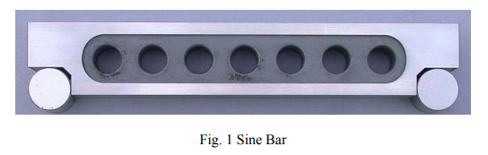

## Introduction

<b>Discipline | <b> Mechanical Engineering 
:--|:--|
<b> Lab | <b> ** Metrology and Measurement Laboratory**
<b> Experiment|     <b> **Measurement of Taper using Sine Bar and Experiment 3**

### About the Experiment 
**System description**

A sine bar is a tool used to measure angles in metalworking. It consists of a hardened, precision 
ground body with two precision ground cylinders fixed at the ends. The distance between the 
centers of the cylinders is precisely controlled, and the top of the bar is parallel to a line through the 
centers of the two rollers as shown in Fig. 1

            

The dimension between the two rollers is chosen to be a whole number (for ease of later 
calculations) and forms the hypotenuse of a triangle when in use.

