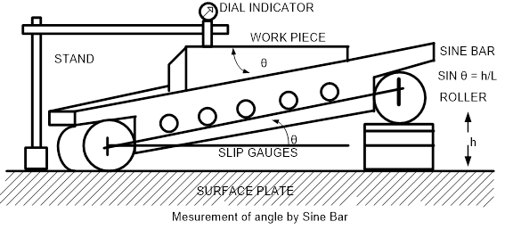
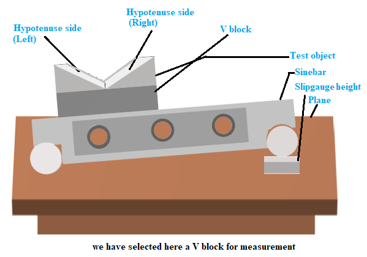

## Procedure

<!-- **Schematic of the Plant**

            

 -->

**Steps to perform the simuation**

1. At first select the 'One side taper' as the test object by clicking on 'Select test object' dropdown button. 

2. Add height(H) or slip gauge to make the hypotenuse side of the object parallel to the plane (brown plane).
Add the slip gauges of particular height(mm) from the given 'Add slip gauge height(H)(mm)' dropdown list. The height(H) can be increased by adding other slip gauges from the dropdown list.
The total height(mm) after adding slip gauges will be shown in the input box below the dropdown list.
Slip gauges can be removed by clicking on 'Remove slip gauge' button.
When it seems to be parallel with brown plane (when H &thickapprox; 63.5),
click on 'Calibrate' button. The dial gauge will show 0 deflection exactly.

3. Click on 'Table' at the bottom of the page to see the observation table and click on 'Add to Table' button to fill the observation table. 

4. Click on 'Clear' button to erase the observation data. Click on 'Table' button to hide the observation table.

5. Now select the 'V block' as the test object by clicking on 'Select test object' dropdown button.

            

6. Select the object position on Sinebar to either left or right side from the given 'Choose object position on sinebar' dropdown button.

7. Measure the angle of corresponding side by following steps 2-4.

8. Change the position of the object to other side of the Sinebar and measure the angle following the steps 2-4.
