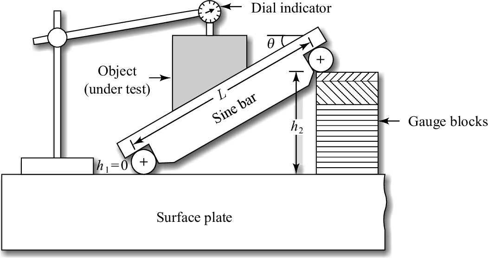
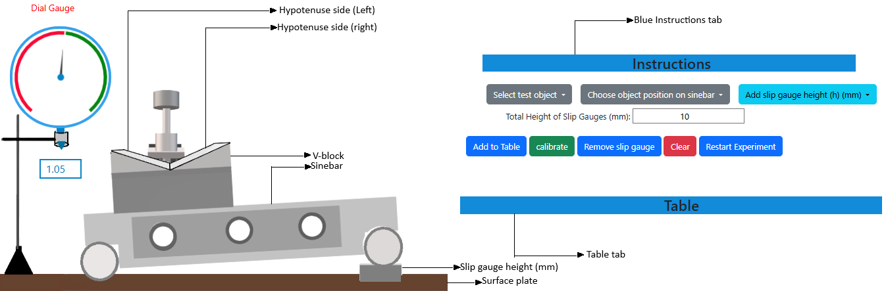

## Procedure

**Steps to perform the simuation**

1. The experiment began with selecting the surface plate as the datum surface, as illustrated in Fig. 1.
To follow the instructions on the simulation page click on the blue Instructions tab. 

<b>Fig. 1. Measurement of angle by sine bar</b>

<b>Fig. 2. Simulation interface for measurement of the taper of a V-block using a sine bar</b>

2.	The component, whether a one-sided taper or a V-block, whose angle necessitated assessment, was firmly attached to the sine bar, and both were placed on the surface plate, as represented in Fig. 2.

3.	A dial gauge, affixed to a suitable stand, was situated adjacent to the sine bar to ensure the plunger glided smoothly along the component's surface. The dial gauge was calibrated to zero at one end. 

4.	Now, for the first case, the 'one-sided taper' object can be selected as the test object by clicking on the 'select test object' dropdown button available on the simulation page.

5.	During the execution of the experiment involving the one-sided taper test object, it is essential to position the test object on the sine bar such that the taper side (hypotenuse side) aligns parallel to the surface plate. To achieve this, specific slip gauges of designated height (in mm) must be incorporated beneath the roller by selecting the 'Add slip gauge height (h) (mm)' option from the dropdown list.

6.	The complete contact between the slip gauge was done by wringing. Wringing is done by hand by sliding and twisting motions.  One gauge is placed perpendicular to the other using standard gauging pressure, and then a rotary motion is applied until the blocks are aligned.  In this way, air is expelled from between the gauge faces, causing the blocks to adhere to each other. 

7.	The total height (in mm) resulting from the addition of the slip gauges will be displayed in the box located beneath the dropdown options. To remove slip gauges, select the 'Remove slip gauge' option.

8.	The slip gauges must be added until the taper or hypotenuse side is aligned parallel with the surface plate. When it is aligned parallel to the surface plate, proceed by clicking the 'Calibrate' button. 

9.	The same dial gauge was moved over its surface from one end to another, and the deflection reading was recorded. The height of the slip gauges beneath one end of the sine bar was adjusted until the dial gauge indicated zero deflection over the entire workpiece surface. 

10.	To access the observation table, one must select the 'Table' tab, and to populate the observation table, it is necessary to click the 'Add to Table' button.

11.	The observation table is designed to present the computed taper angle. Upon completion of the experiment, the observation data may be deleted by selecting the 'Clear' button.

12.	In the second scenario, for measuring the taper of a V-block, the V-block has to be selected as the test object from the 'Select test object' dropdown button.

13.	The placement of the object on the sine bar can be adjusted to either the left or right side by making a selection from the 'Choose object position on sine bar' dropdown menu.

14.	The required taper angle of the relevant side of the V-block can be ascertained by adhering to the procedures outlined in steps 5-11.

15. Click on 'Restart Experiment' button to restart the experiment.
