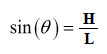
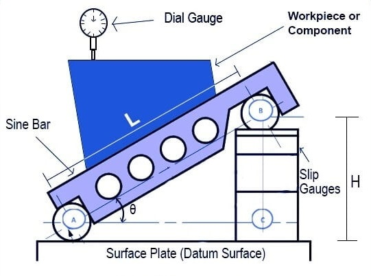

## Theory

 A sine bar is a type of precision measuring tool used for accurate measurement of angles and, in particular, for inspecting the taper of workpieces. The idea behind a sine bar is based on trigonometry, where the precise taper angle can be calculated from the sine of the angle created between the sine bar and the workpiece. A sine bar is used in conjunction with slip gauge blocks for precise angular measurements.Slip gauges are used as standard length measurement. A sine bar is used either to measure an angle very accurately or face locate any work to a given angle. Sine bars are made from a high chromium corrosion-resistant steel and are hardened, precision ground, and stabilized. Two cylinders of equal diameter are placed at the ends of the bar. The axes of these two cylinders are mutually parallel to each other and at equal distance from the upper surface of the sine bar. Accuracy up to 0.01 mm/m of the length of the sine bar can be attained. A sine bar is generally used with slip gauge blocks. The sine bar forms the hypotenuse of a right triangle, while the slip gauge blocks form the opposite side. The height of the slip gauge block is found by multiplying the sine of the desired angle by the length of the sine bar: H = L &times; sin(θ).  

Some important considerations of a Sine bar are as follows:

1. Sine Principle: The sine bar operates on the sine principle, which is based on the trigonometric relationship between the sine of an angle and the length of the opposite side. The key relationship used is:

            

Where:

- θ is the angle to be measured (taper angle);

- H is the height difference between the two ends of the sine bar.

- L is the distance between the centers of the sine bar's cylindrical surfaces.

As shown in the figure.

2. Workpiece Clamping: To measure the taper of a workpiece using a sine bar, the workpiece is securely clamped at the center of the sine bar, ensuring that the taper to be measured rests on the flat surface of the sine bar.

3. Height Adjustment: The sine bar needs to be set up so that its upper and lower ends are parallel to the workpiece's taper. This is achieved by placing various slip gauges of known length under one end of the sine bar. The height of these slip gauges is carefully chosen to ensure parallelism. The complete contact between the slip gauges is done by wringing. Wringing is done by hand by sliding and twisting motions.  One gauge is placed perpendicular to the other using standard gauging pressure, and then a rotary motion is applied until the blocks are lined up.  In this way air is expelled from between the gauge faces, causing the blocks to adhere.

            

				

						
								